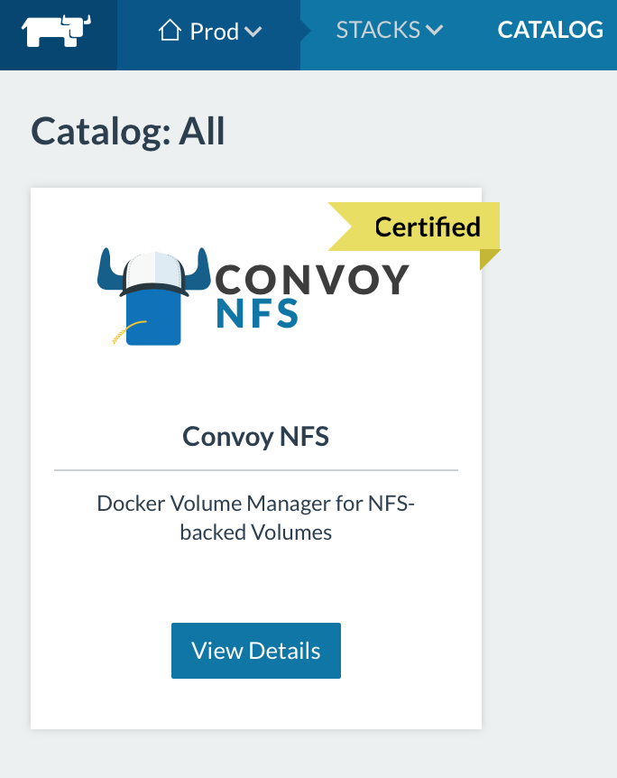
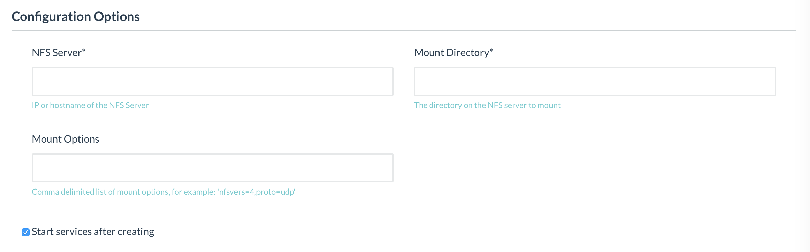

# Convoy NFS service for Docker volume sync


## Setup NFS server for Convoy NFS service

http://rancher.com/setting-shared-volumes-convoy-nfs/


#### Ubuntu nfs-kernel-server

https://www.digitalocean.com/community/tutorials/how-to-set-up-an-nfs-mount-on-ubuntu-14-04

```shell
sudo apt-get update && sudo apt-get -y install nfs-kernel-server
sudo vim /etc/exports
## /home       111.111.111.111(rw,sync,no_root_squash,no_subtree_check)
## /var/nfs    111.111.111.111(rw,sync,no_subtree_check)
## /docker/convoy-nfs *(rw,sync,no_root_squash,no_subtree_check)
sudo exportfs -a
sudo service nfs-kernel-server start
```

#### CentOS NFS server

https://www.digitalocean.com/community/tutorials/how-to-set-up-an-nfs-mount-on-centos-6

```shell
sudo -s
yum install -y nfs-utils nfs-utils-lib
chkconfig nfs on 
service rpcbind start
service nfs start
## /home       111.111.111.111(rw,sync,no_root_squash,no_subtree_check)
## /var/nfs    111.111.111.111(rw,sync,no_subtree_check)
## /docker/convoy-nfs *(rw,sync,no_subtree_check)
sudo exportfs -a
```


## Start Convoy-NFS from Rancher Console





NFS Server: <IP>

Mount Directory: /docker/convoy-nfs


#### S3 Fuse File system for backup

```shell
ACCESSKEY=<AWS access key idenetity>
SECRET=<AWS Private key>
BUCKET="tutormeetplus-convoy-nfs" #S3 bueckt name 
MOUNT="/mnt/s3"

```

```shell
echo $ACCESSKEY:$SECRET > ~/.passwd-s3fs
sudo s3fs $BUCKET $MOUNT
```


## Manual Install Convoy NFS without Rancher Service


### Install Convoy plugin for Server

https://github.com/rancher/convoy


```shell
wget https://github.com/rancher/convoy/releases/download/v0.5.0/convoy.tar.gz
tar xvf convoy.tar.gz
sudo cp convoy/convoy convoy/convoy-pdata_tools /usr/local/bin/

sudo mkdir -p /etc/docker/plugins/
sudo bash -c 'echo "unix:///var/run/convoy/convoy.sock" > /etc/docker/plugins/convoy.spec'
```

#### Start convoy daemon

```
sudo convoy daemon --drivers vfs --driver-opts vfs.path=/mnt/registry-data &
```


#### Mount Convoy-NFS folder

```shell
sudo mkdir /mnt/registry-data
sudo mount -t nfs 172.16.9.16:/docker/convoy-nfs/registry-data /mnt/registry-data
```


### Install NFS common lib for client side

```
sudo apt-get install -y nfs-common && \
sudo mkdir -p /mnt/nfs/record && \
sudo mount -t nfs4 172.16.7.238:/record /mnt/nfs/record
```

